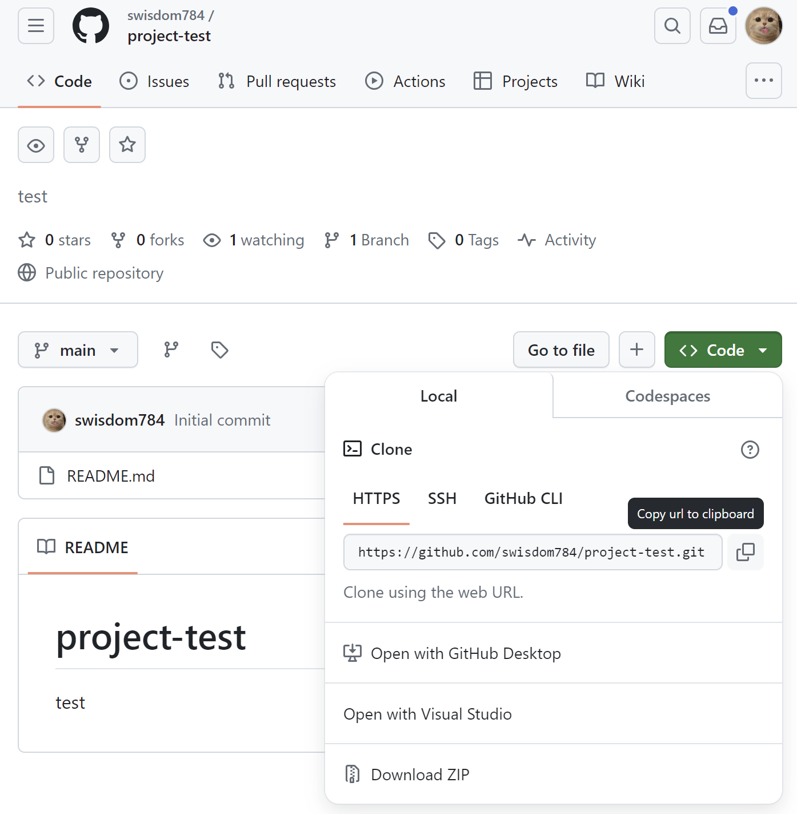
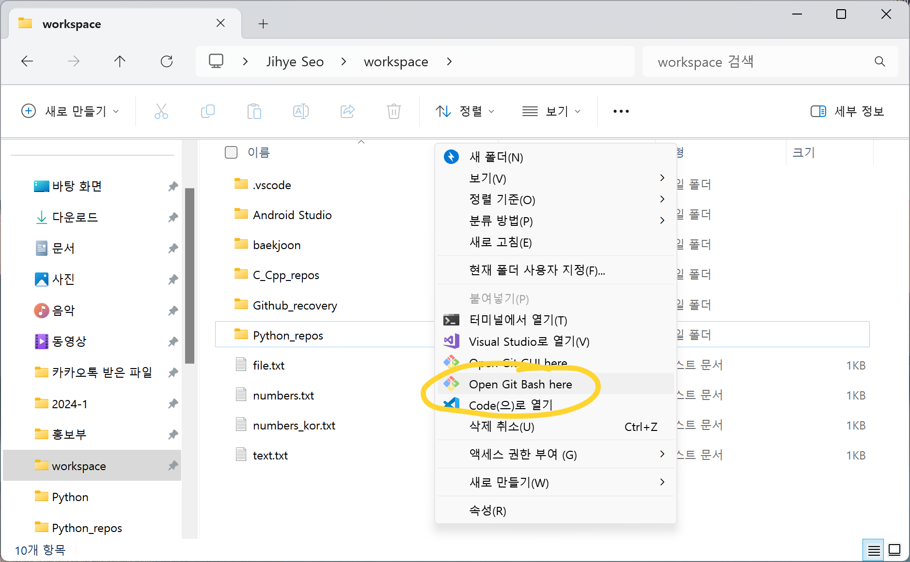
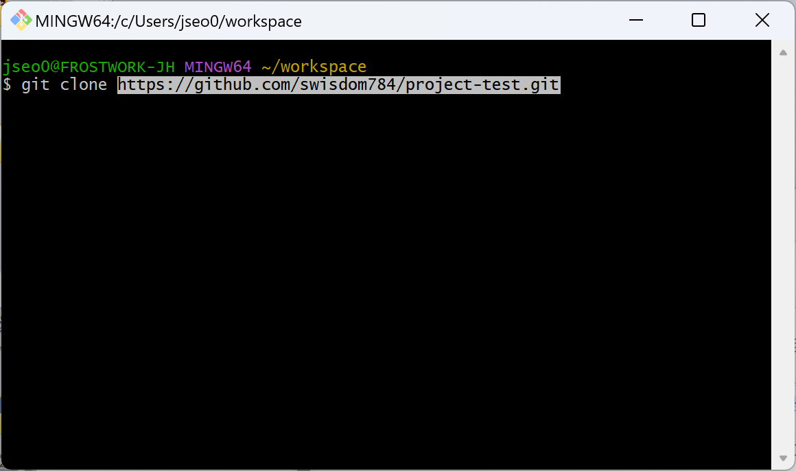
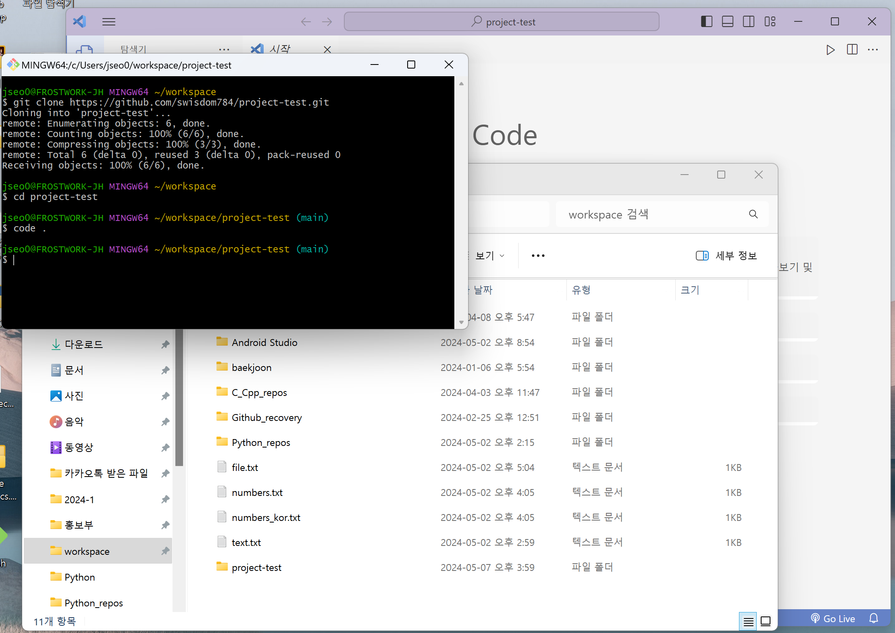
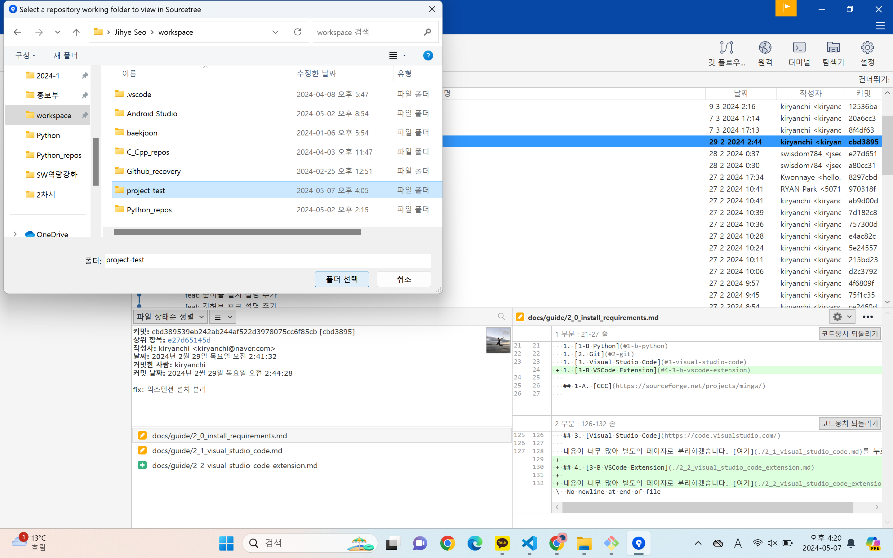
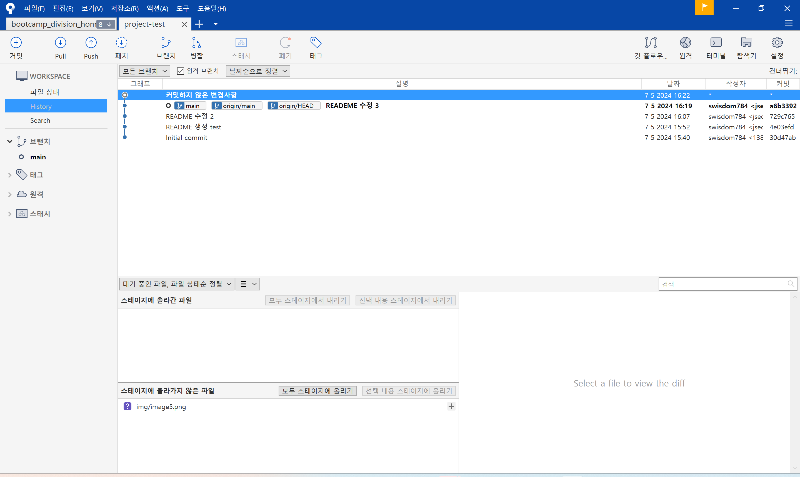

# 모바일 앱 프로그래밍 프로젝트

2024-1학기에 진행한 모바일 앱 프로그래밍 프로젝트입니다.

> [!IMPORTANT]
>
> fork한 후, README 페이지를 자유롭게 수정해서 사용하셔도 됩니다.
>
> Github는 **포트폴리오**로 사용되는 만큼 깔끔하고 꾸준하게 관리하는 것이 좋습니다.

## 🚨 깃허브 협업 시작하기

### Step1. 팀 레포지토리에 팀원 초대하기
- 프로젝트 관리자가 프로젝트를 생성한다.
    - Settings -> Collaborators -> Add collaborator
- 메일로 `Collaborator` 초대를 받은 뒤 `Accept invitation`을 눌러 수락한다.
- 관리자가 레포지토리 상단에서 `pin`을 클릭하면 즐겨찾기에 추가되고, 팀원들의 프로필 메인에서도 볼 수 있다.

### Step2. 로컬 레포지토리와 연결하기

- Github에서 원격 레포지토리 url을 복사한다.
    

- 프로젝트를 생성할 상위 폴더에서 `open Git Bash here` 을 클릭해 **git bash**를 열어준다. 
    
- git bash에서 repository를 `clone`한다.
    

- clone한 repository를 **Visual Studio Code**로 열어준다.
    

### Step3. Sourcetree와 연결하기
- `Sourcetree`를 실행한다.
    - 파일 -> 열기 -> 폴더선택
        
        
- 쉽게 프로젝트와 브랜치를 관리할 수 있게 된다.
