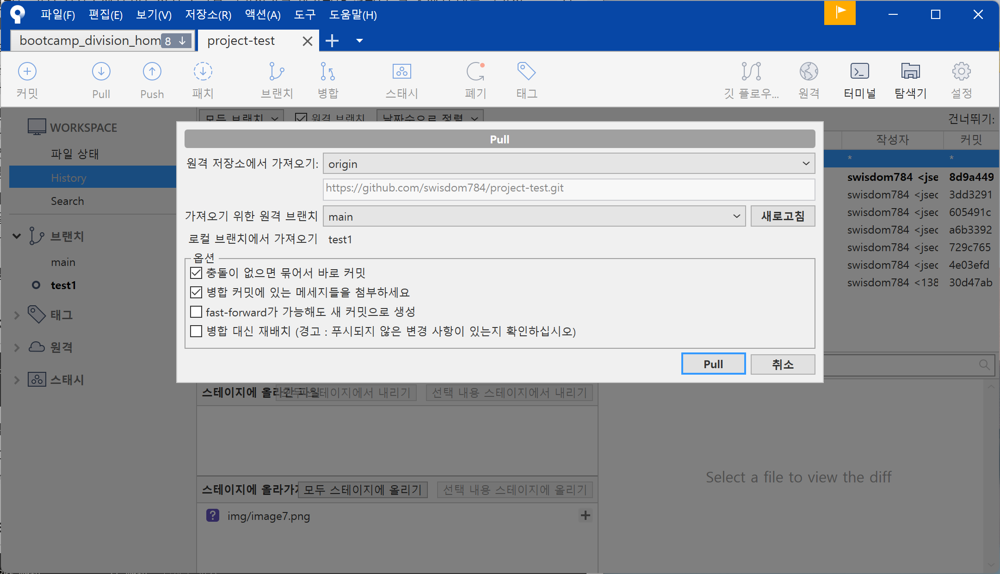
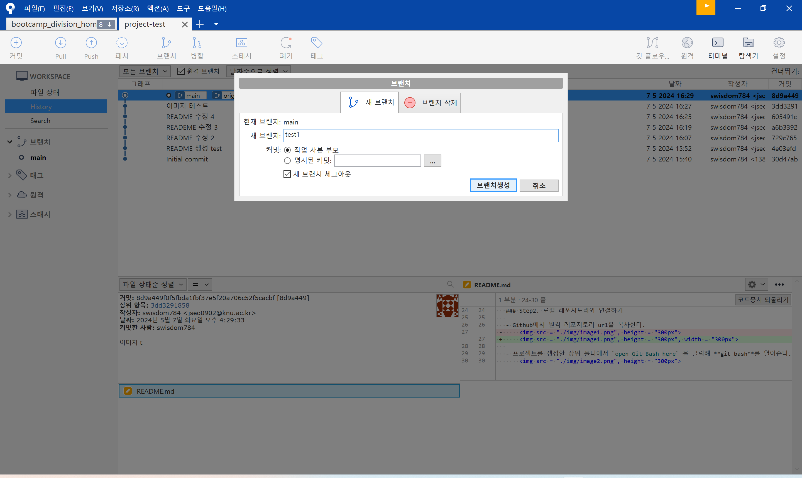
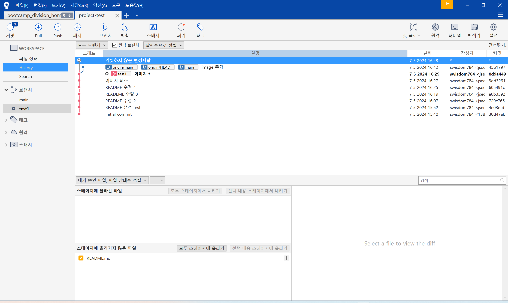

# 모바일 앱 프로그래밍 프로젝트

2024-1학기에 진행한 모바일 앱 프로그래밍 프로젝트입니다.

> [!IMPORTANT]
>
> fork한 후, README 페이지를 자유롭게 수정해서 사용하셔도 됩니다.
>
> Github는 **포트폴리오**로 사용되는 만큼 깔끔하고 꾸준하게 관리하는 것이 좋습니다.

## 🚨 깃허브 협업 시작하기

### Step1. 팀 레포지토리에 팀원 초대하기

- 프로젝트 관리자가 프로젝트를 생성한다.
    - Settings -> Collaborators -> Add collaborator

- 메일로 `Collaborator` 초대를 받은 뒤 `Accept invitation`을 눌러 수락한다.

- 관리자가 레포지토리 상단에서 `pin`을 클릭하면 즐겨찾기에 추가되고, 팀원들의 프로필 메인에서도 볼 수 있다.

### Step2. 로컬 레포지토리와 연결하기

- Github에서 원격 레포지토리 url을 복사한다.
    

- 프로젝트를 생성할 상위 폴더에서 `open Git Bash here` 을 클릭해 **git bash**를 열어준다. 
    

- git bash에서 repository를 `clone`한다.
    

- clone한 repository를 **Visual Studio Code**로 열어준다.
    

### Step3. Sourcetree와 연결하기
- `Sourcetree`를 실행한다.

    - 파일 -> 열기 -> 폴더선택
        
        

- 쉽게 프로젝트와 브랜치를 관리할 수 있게 된다.

## ✨ Github 협업 가이드

- 로컬 저장소에서 작업을 한 후에는 원격저장소로 업로드 해 결과물을 합쳐야 한다.

- **`main`** 은 완성물만 있어야 하기 때문에 작업물을 올리고 문제가 없는지 확인한 후 `main` 브랜치로 합쳐야 한다.

- 따라서 자신의 작업물을 만든 후에는 **새로운 브랜치**를 파고 거기에 `push` 한다.

- 이후 팀원들이 새로운 브랜치에 `push`된 내용을 확인하고, 문제가 없다는 것이 확인되면 `main` 브랜치로 **`merge`** 요청을 하면 된다. 이를 관리자가 승인하면 `main` 브랜치로 합쳐진다.

### 내 작업물 만들기

- Sourcetree를 켠다.
- 작업을 진행하기 전, `Pull`을 먼저 해준다.
    - `Pull` -> `main` pull 해주기
        

- Sourcetree -> 브랜치 -> 브랜치 생성
    

- 작업한다.

- 다음과 같이 main이 변경되었고, branch도 내가 작업물을 만들어 변경되었다.
    
